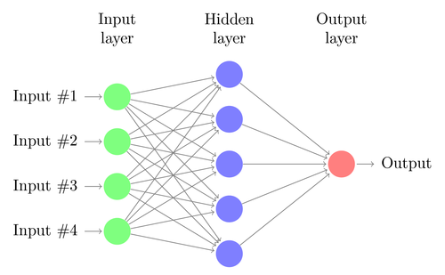

# Flappy-Bird-AI :baby_chick:
Artificial Intelligence based Flappy Bird Game

## LIVE: https://imskr.github.io/Flappy-Bird-AI/

  Created by <a href="https://github.com/imskr"><strong>Shubham Kumar</strong></a>

  

 

### Libraries

* **Processing.js**
* **Javascript**

* **Explanation**
This Project uses neural-network & genetic algorithm for bird's brain.

### References

* **The Coding Train** [NN](https://github.com/CodingTrain/Toy-Neural-Network-JS)
* **Demystifying RL** [Intel](https://www.intel.ai/demystifying-deep-reinforcement-learning/#gs.0lgpgr)
